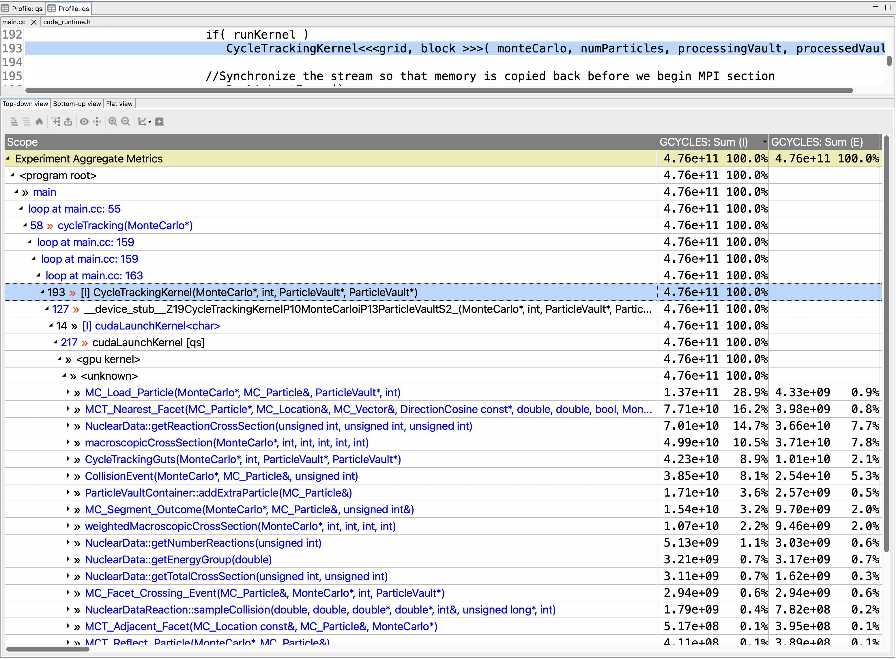
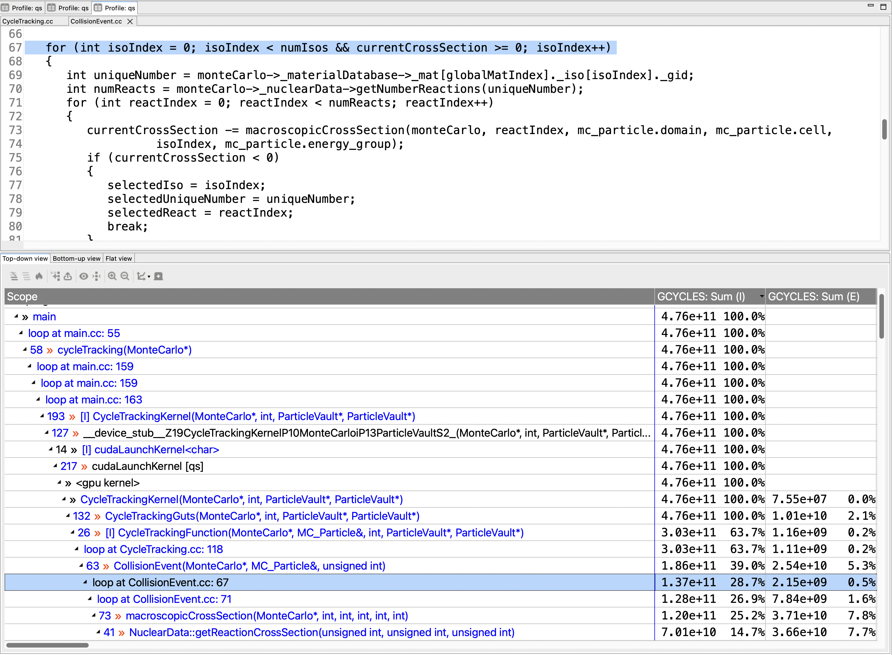
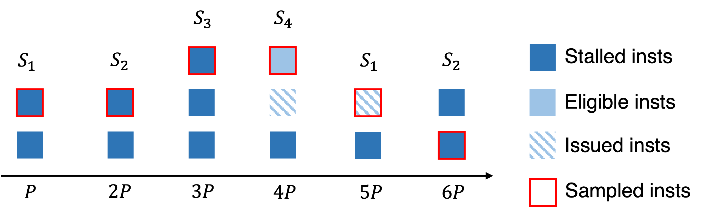

<!--
SPDX-FileCopyrightText: Contributors to the HPCToolkit Project

SPDX-License-Identifier: CC-BY-4.0
-->

(chpt:gpu)=

# Measurement and Analysis of GPU-accelerated Applications

HPCToolkit can measure both the CPU and GPU performance of GPU-accelerated applications. It can measure CPU performance using asynchronous sampling triggered by Linux timers or hardware counter events as described in
Section [5.3](#sample-sources) and it can monitor the performance of GPU operations using tool support libraries provided by GPU vendors.

A single version of HPCToolkit can be built that supports GPUs from multiple vendors and programming models. However, using HPCToolkit to collect GPU metrics using GPUs from multiple vendor runtimes (e.g. CUDA and ROCm) in a single execution is largely untested although measuring GPU offloading using both Level Zero and OpenCL is known to work.

In the following sections, we describe a generic substrate in HPCToolkit to interact with vendor specific runtime systems and libraries.
We begin by describing some common measurement capabilities (profiling, tracing, PC sampling) available across all GPU families.
We follow that with a description of measurement capabilities specific to particular GPU vendors.

## GPU Performance Measurement Substrate

HPCToolkit's measurement subsystem supports profiling and tracing of GPU operations as well as instruction-level performance measurement using Program Counter (PC) sampling. We discuss the support for each of these measurement modalities in the following subsections.

### Profiling GPU Operations

The foundation of HPCToolkit's support for measuring the performance of GPU-accelerated applications is a vendor-independent monitoring substrate. A thin software layer connects NVIDIA's [CUPTI](https://docs.nvidia.com/cupti) (CUDA Performance Tools Interface) and AMD's [Rocprofiler-sdk](https://rocm.docs.amd.com/projects/rocprofiler-sdk) monitoring libraries to this substrate. The substrate also includes function wrappers to intercept calls to the OpenCL API and Intel's Level Zero API to measure GPU performance for programming models that do not have an integrated measurement substrate such as CUPTI or Rocprofiler-sdk.
HPCToolkit reports GPU performance metrics in a vendor-neutral way. For instance, rather than focusing on NVIDIA warps or AMD wavefronts, HPCToolkit presents both as fine-grain, thread-level parallelism.

HPCToolkit supports two levels of performance monitoring for GPU accelerated applications: coarse-grain profiling and tracing of GPU activities at the operation level (e.g., kernel launches, data allocations, memory copies, ...), and fine-grain measurement of GPU computations using PC sampling or instrumentation, which measure GPU computations at the granularity of individual machine instructions.

Coarse-grain profiling attributes to each calling context the total time of all GPU operations initiated in that context. Table [8.1](#table:gtimes) shows the classes of GPU operations for which timings are collected. For AMD and NVIDIA GPUs, HPCToolkit also reports GPU kernel characteristics, including including register usage, thread count per block, and theoretical occupancy as shown in Table [8.2](#table:gker). HPCToolkit derives a theoretical GPU occupancy metric as the ratio of the active threads in a streaming multiprocessor to the maximum active threads supported by the hardware in an AMD compute unit or an NVIDIA streaming multiprocessor.

In addition, HPCToolkit records metrics for operations performed including memory allocation and deallocation (Table [8.3](#table:gmem)), memory set (Table [8.4](#table:gmset)), explicit memory copies (Table [8.5](#table:gxcopy)), and synchronization (Table [8.6](#table:gsync)). These operation metrics are available for GPUs from all three vendors. While summary metrics in Table [8.1](#table:gtimes) and Table [8.2](#table:gker) are shown by default in hpcviewer, metrics marked with an asterisk in Table [8.3](#table:gmem)), Table [8.4](#table:gmset)), Table [8.5](#table:gxcopy)), and Table [8.6](#table:gsync) are hidden by default to avoid overwhelming users with many columns of metrics. However, one can reveal any of these hidden metrics by simply opening the metric pane in hpcviewer marking them as visible.

```{table} Table 8.1: GPU operation timings.
---
name: table:gtimes
---
| Metric       | Description                                        |
| :----------- | :------------------------------------------------- |
| GKER (sec)   | GPU time: kernel execution (seconds)               |
| GMEM (sec)   | GPU time: memory allocation/deallocation (seconds) |
| GMSET (sec)  | GPU time: memory set (seconds)                     |
| GXCOPY (sec) | GPU time: explicit data copy (seconds)             |
| GSYNC (sec)  | GPU time: synchronization (seconds)                |
| GPUOP (sec)  | Total GPU operation time: sum of all metrics above |
```


```{table} Table 8.2: GPU kernel characteristic metrics.
---
name: table:gker
---
| Metric          | Description                                 |
| :-------------- | :------------------------------------------ |
| GKER:STMEM (B)  | GPU kernel: static memory (bytes)           |
| GKER:DYMEM (B)  | GPU kernel: dynamic memory (bytes)          |
| GKER:LMEM (B)   | GPU kernel: local memory (bytes)            |
| GKER:FGP_ACT    | GPU kernel: fine-grain parallelism, actual  |
| GKER:FGP_MAX    | GPU kernel: fine-grain parallelism, maximum |
| GKER:THR_REG    | GPU kernel: thread register count           |
| GKER:BLK_THR    | GPU kernel: thread count                    |
| GKER:BLK        | GPU kernel: block count                     |
| GKER:BLK_SM (B) | GPU kernel: block local memory (bytes)      |
| GKER:COUNT      | GPU kernel: launch count                    |
| GKER:OCC_THR    | GPU kernel: theoretical occupancy           |
```

```{table} Table 8.3: GPU memory allocation and deallocation. Note: metrics marked with * are hidden by default.
---
name: table:gmem
---
| Metric       | Description                                          |
| :----------- | :--------------------------------------------------- |
| GMEM:UNK (B)* | GPU memory alloc/free: unknown memory kind (bytes)   |
| GMEM:PAG (B)* | GPU memory alloc/free: pageable memory (bytes)       |
| GMEM:PIN (B)* | GPU memory alloc/free: pinned memory (bytes)         |
| GMEM:DEV (B)* | GPU memory alloc/free: device memory (bytes)         |
| GMEM:ARY (B)* | GPU memory alloc/free: array memory (bytes)          |
| GMEM:MAN (B)* | GPU memory alloc/free: managed memory (bytes)        |
| GMEM:DST (B)* | GPU memory alloc/free: device static memory (bytes)  |
| GMEM:MST (B)* | GPU memory alloc/free: managed static memory (bytes) |
| GMEM:COUNT   | GPU memory alloc/free: count                         |
```

```{table} Table 8.4: GPU memory set metrics. Note: metrics marked with * are hidden by default.
---
name: table:gmset
---
| Metric        | Description                                   |
| :------------ | :-------------------------------------------- |
| GMSET:UNK (B)* | GPU memory set: unknown memory kind (bytes)   |
| GMSET:PAG (B)* | GPU memory set: pageable memory (bytes)       |
| GMSET:PIN (B)* | GPU memory set: pinned memory (bytes)         |
| GMSET:DEV (B)* | GPU memory set: device memory (bytes)         |
| GMSET:ARY (B)* | GPU memory set: array memory (bytes)          |
| GMSET:MAN (B)* | GPU memory set: managed memory (bytes)        |
| GMSET:DST (B)* | GPU memory set: device static memory (bytes)  |
| GMSET:MST (B)* | GPU memory set: managed static memory (bytes) |
| GMSET:COUNT   | GPU memory set: count                         |
```

```{table} Table 8.5: GPU explicit memory copy metrics. Note: metrics marked with * are hidden by default.
---
name: table:gxcopy
---
| Metric         | Description                                        |
| :------------- | :------------------------------------------------- |
| GXCOPY:UNK (B)* | GPU explicit memory copy: unknown kind (bytes)     |
| GXCOPY:H2D (B)* | GPU explicit memory copy: host to device (bytes)   |
| GXCOPY:D2H (B)* | GPU explicit memory copy: device to host (bytes)   |
| GXCOPY:H2A (B)* | GPU explicit memory copy: host to array (bytes)    |
| GXCOPY:A2H (B)* | GPU explicit memory copy: array to host (bytes)    |
| GXCOPY:A2A (B)* | GPU explicit memory copy: array to array (bytes)   |
| GXCOPY:A2D (B)* | GPU explicit memory copy: array to device (bytes)  |
| GXCOPY:D2A (B)* | GPU explicit memory copy: device to array (bytes)  |
| GXCOPY:D2D (B)* | GPU explicit memory copy: device to device (bytes) |
| GXCOPY:H2H (B)* | GPU explicit memory copy: host to host (bytes)     |
| GXCOPY:P2P (B)* | GPU explicit memory copy: peer to peer (bytes)     |
| GXCOPY:COUNT   | GPU explicit memory copy: count                    |
```

```{table} Table 8.6: GPU synchronization metrics. Note: metrics marked with * are hidden by default.
---
name: table:gsync
---
| Metric           | Description                             |
| :--------------- | :-------------------------------------- |
| GSYNC:UNK (sec)*  | GPU synchronizations: unknown kind      |
| GSYNC:EVT (sec)*  | GPU synchronizations: event             |
| GSYNC:STRE (sec)* | GPU synchronizations: stream event wait |
| GSYNC:STR (sec)*  | GPU synchronizations: stream            |
| GSYNC:CTX (sec)*  | GPU synchronizations: context           |
| GSYNC:COUNT      | GPU synchronizations: count             |
```

### Instruction-level Profiling within GPU kernels using PC Sampling

HPCToolkit attributes instruction-level performance metrics collected using Program Counter (PC) samples on AMD, Intel and NVIDIA GPUs in a vendor-neutral way. All implementations of PC sampling on GPUs periodically interrupt the execution of a kernel on a GPU to record the value of the program counter to identify the instruction that a component of the GPU, e.g. a streaming multiprocessor or compute unit, is executing.
HPCToolkit also provides some fine-grain measurements on Intel GPUs using binary instrumentation. Not every instruction-level metric is available for all GPUs.

Using PC sampling, HPCToolkit attributes GPU metrics to heterogeneous calling contexts that include the CPU calling context in which a GPU kernel was launched as a prefix and the calling context within a kernel where the PC sample was collected as the suffix.
To our knowledge, no GPU provides hardware or software support for attributing metrics directly to calling contexts within GPU kernels.
To compensate, HPCToolkit reconstructs GPU calling contexts from static GPU call graphs within kernels on AMD, Intel, and NVIDIA GPUs. HPCToolkit uses samples of a kernel's calls to device functions in conjunction with data flow analysis of the kernel to apportion metrics among call sites in a kernel's GPU calling context tree.

PC sampling on Intel and NVIDIA GPUs is supported by hardware. AMD GPUs have two strategies for collecting PC samples: one supported entirely in software and one supported by hardware.  Table [8.7](#table:gpu:cycles) shows three high-level metrics that can be collected using PC sampling. All implementations of PC sampling report  `GCYCLES` - an estimate of GPU cycles. This metric is an estimate for two reasons.

First, when sampling with a period of `N` instructions, each time a sample is recorded, HPCToolkit charges `N` cycles to the machine instruction indicated by the program counter. This strategy has the advantage that the measurement results should be independent of the sampling period. NVIDIA GPUs and AMD's hardware supported stochasitic sampling both use sampling periods specified using a number of instructions. When measuring a program using PC sampling, one can specify a sampling period by adding an `@k` to the end of the argument enabling PC sampling; this will set the sampling period to `2^k`. (We explain in more detail how to enable PC sampling for each of the GPU runtimes in subsequent sections.)

Second, Intel's Level Zero runtime and AMD's software implementation of PC sampling for MI200+ GPUs specify the sampling period as time rather than the number of instructions. For consistency, we use nanoseconds as the unit of time. Like the aforementioned implementations with instruction-level periods, HPCToolkit's implementation of PC sampling for Intel and AMD's software implementation of PC sampling use `@k` to indicate a sampling period of `2^k`; however, the period for these implementations is in nanoseconds rather than cycles. For both Intel and AMD GPUs, base clock frequencies are approximately 1GHz. While boosted clock frequencies can be as much as twice as fast, HPCToolkit doesn't attempt to correct for that. Instead, HPCToolkit treats nanoseconds and clock cycles as interchangeable. Even when using time-based periods, HPCToolkit reports GPU measurements as `GCYCLES`. With clock scaling, this may be off by as much as a factor of two. However, for the purpose of identifying which source lines within kernels consume resources, the metrics will accumulate at the proper locations with the proper relative costs for different locations regardless of whether the metric actually is a measure of GPU cycles or nanoseconds.

When using AMD's software support for PC sampling, `GCYCLES` is the only metric that can be collected; when processing a PC sample at runtime, no information is available about whether the sampled instruction issued or stalled. In contrast, hardware support for PC sampling on AMD, Intel, and NVIDIA GPUs can also report whether the sampled instruction was issued (`GCYCLES:ISU`) or whether the sampled instruction stalled (`GCYCLES:STL`) and was not issued. As with `GCYCLES`, measurements of `GCYCLES:ISU` and `GCYCLES:STL` are scaled by multiplying the actual count of samples by the sample period.

HPCToolkit reports stalls `GCYCLES:STL` only if the latency of a stall is exposed. On an NVIDIA GPU, HPCToolkit only considers a sampled instruction to be a stall if NVIDIA's CUPTI reports the instruction as a latency sample, which means that no instruction issued on the GPU in the cycle when the sample was recorded. On an AMD GPU, AMD's Rocprofiler-sdk reports the type of instruction that issued. AMD instruction types are shown in Table [8.11](#table:amd-issues). HPCToolkit only considers an instruction of type `X` to be a stall if instruction `X` should issue to pipeline `Y`, and pipeline `Y` did not issue an instruction in the current cycle.
Each of the GPUs report when a sampled instruction is ready to execute but was `NOT_SELECTED`. HPCToolkit doesn't consider `NOT_SELECTED` as an exposed stall. An instruction that is `NOT_SELECTED` stalled only because another instruction is executing instead. When the latency of a stalled instruction is overlapped with execution of another instruction, a developer need not be concerned about the reason for the stall. GPUs are designed to hide the latency of stalled instructions by interleaving the execution of instructions from different warps or wavefronts and overlapping one warp or wavefront's stall with execution of an instruction from another warp or wavefront.

```{table} Table 8.7: GPU cycles are issues or stalls.
---
name: table:gpu:cycles
---
| Metric          | Description                                                          |
| :-------------- | :------------------------------------------------------------------- |
| GCYCLES         | GPU cycles (estimated using PC sampling)                             |
| GCYCLES:ISU     | GPU issue cycles: a sampled instruction was issued by the front end  |
| GCYCLES:STL     | GPU stall cycles: a sampled instruction represents an exposed stall  |
```

Besides reporting the summary metric `GCYCLES:STL` of exposed stalls, HPCToolkit additionally measures and attributes reasons for exposed stalls. HPCToolkit maps stall reasons from AMD, Intel, and NVIDIA GPUs into a common vocabulary of stall reasons. Table [8.7](#table:issue-stall) shows stall metrics recorded by HPCToolkit using hardware support for PC sampling on AMD, Intel, and NVIDIA GPUs. In some cases, the mapping is precise. For instance, NVIDIA GPUs report separate stall reasons for stalls related to global memory (`GCYCLES:STL:GMEM`), texture memory  (`GCYCLES:STL:TMEM`), and constant memory  (`GCYCLES:STL:CMEM`). In contrast, AMD GPUs simply report stalls that arise from `waitcnt` instructions, which explicitly await completion of loads from anywhere in the memory hierarhcy, whether the load will be satisfied by the Local Data Store (LDS), the L2 cache, or global memory. Accordingly, HPCToolkit reports all memory-related stalls on AMD GPUs using a single metric `GCYCLES:STL:MEM`. On Intel GPUs, reporting is a bit more muddled. Memory-related stalls are typically reported as SCOREBOARD IDid stalls or SEND stalls. We report Intel SCOREBOARD ID stalls at `GCYCLES:STL:MEM` and SEND stalls as `GCYCLES:STL:GMEM` since SEND instructions are used to send messages to other components
or write to device memory.

```{table} Table 8.12: GPU issue stall metrics. Note: metrics marked with * are hidden by default.
---
name: table:issue-stall
---
| Metric            | Description                                                                                                 |
| :---------------- | :---------------------------------------------------------------------------------------------------------- |
| GCYCLES:STL       | GPU exposed instruction issue stall cycles: any kind                                                        |
| GCYCLES:STL:MEM*   | GPU exposed instruction issue stall cycles: await completion of a kind of memory access                     |
| GCYCLES:STL:GMEM*  | GPU exposed instruction issue stall cycles: await completion of a global memory access                      |
| GCYCLES:STL:MTHR* | GPU exposed instruction issue stall cycles: global memory request queue full                                |
| GCYCLES:STL:TMEM* | GPU exposed instruction issue stall cycles: texture memory request queue full                               |
| GCYCLES:STL:CMEM* | GPU exposed instruction issue stall cycles: await completion of constant or immediate memory access         |
| GCYCLES:STL:IFET* | GPU exposed instruction issue stall cycles: await availability of next instruction (fetch or branch delay   |
| GCYCLES:STL:IDEP* | GPU exposed instruction issue stall cycles: await satisfaction of instruction input dependence              |
| GCYCLES:STL:PIPE* | GPU exposed instruction issue stall cycles: await completion of required compute resources                  |
| GCYCLES:STL:SYNC* | GPU exposed instruction issue stall cycles: await completion of thread or memory synchronization            |
| GCYCLES:STL:OTHR* | GPU exposed instruction issue stall cycles: other                                                           |
| GCYCLES:STL:SLP*  | GPU exposed instruction issue stall cycles: sleep                                                           |
```

#### Calling Context Tree Reconstruction for Attributing GPU PC Samples

AMD, Intel, and NVIDIA GPU measurement APIs provide "flat" PC samples without any information about GPU call stacks.
With complex code generated from template-based GPU programming models, calling contexts on GPUs are essential for developers to understand the code and its performance. Lawrence Livermore National Laboratory's GPU-accelerated [Quicksilver proxy app](https://asc.llnl.gov/codes/proxy-apps/quicksilver) illustrates this problem. Figure [8.2](#qs-no-cct) shows a `hpcviewer` screenshot of Quicksilver without approximate reconstruction the GPU calling context tree. The figure shows a top-down view of heterogeneous calling contexts that span both the CPU and GPU. In the middle of the figure is a placeholder `<gpu kernel>` that is inserted by HPCToolkit. Above the placeholder is a CPU calling context where a GPU kernel was invoked. Below the `<gpu kernel>` placeholder, `hpcviewer` shows a dozen of the GPU functions that were executed on behalf of the GPU kernel `CycleTrackingKernel`.

```{figure-md} qs-no-cct


Figure 8.2: A screenshot of `hpcviewer` for the GPU-accelerated Quicksilver proxy app without GPU CCT reconstruction.
```

Currently, no API is available for providing call stacks for PC samples on GPUs.
To address this issue, we designed a method to reconstruct approximate GPU calling contexts using post-mortem analysis. This analysis is only performed when (1) an execution has been monitored using PC sampling, and (2) an execution's GPU binaries have analyzed in detail. On AMD and Intel GPUs, `hpcstruct` analyzes binaries in detail using instruction-level APIs. On NVIDIA GPUs, intstruction-level analysis is only available by running NVIDIA's `nvdisasm` tool, recording its ASCII output, and parsing it. For that reason, `hpcstruct` only performs detailed analysis of NVIDIA GPU binaries when the `--gpucfg yes` option is sp4cified.

To reconstruct approximate calling context trees for GPU computations, HPCToolkit uses information about call sites identified by `hpcstruct` in conjunction with PC samples measured for each `call` instruction in a GPU binary.

Without the ability to measure each function invocation in detail, HPCToolkit assumes that each invocation of a particular GPU function incurs the same costs. The costs of each GPU function are apportioned among its caller or callers using the following rules:

- If a GPU function G can only be invoked from a single call site, all of the measured cost of G will be attributed to its call site.

- If a GPU function G can be called from multiple call sites and PC samples have been collected for one or more of the call instructions for G, the costs for G are proportionally divided among G's call sites according to the distribution of PC samples for calls that invoke G. For instance, consider the case where there are three call sites where G may be invoked, 5 samples are recorded for the first call instruction, 10 samples are recorded for the second call instruction, and no samples are recorded for the third call. In this case, HPCToolkit divides the costs for G among the first two call sites, attributing 5/15 of G's costs to the first call site and 10/15 of G's costs to the second call site.

- If no call instructions for a GPU function G have been sampled, the costs of G are apportioned evenly among each of G's call sites.

IHPCToolkit's `hpcprof` analyzes the static call graph associated with each GPU kernel invocation. If the static call graph for the GPU kernel contains cycles, which arise from recursive or mutually-recursive calls, `hpcprof` replaces each cycle with a strongly connected component (SCC). In this case, `hpcprof` unlinks call graph edges between vertices within the SCC and adds an SCC vertex to enclose the set of vertices in each SCC. The rest of `hpcprof`'s analysis
treats an SCC vertex as a normal "function" in the call graph.

````{note}
---
name: fig:gpu calling context tree
---
```{image} cct-1.png
:width: 60.0%
```

```{image} cct-2.png
:width: 60.0%
```

```{image} cct-3.png
:width: 60.0%
```

```{image} cct-4.png
:width: 80.0%
```

Figure 8.3: Reconstruct a GPU calling context tree. A-F represent GPU functions. Each subscript denotes the number of samples associated with the function. Each (`a`,`c`) pair indicates an edge at address `a` has `c` call instruction samples.
````

```{figure-md} qs-cct


Figure 8.4: A screenshot of `hpcviewer` for the GPU-accelerated Quicksilver proxy app with GPU CCT reconstruction.
```

Figure \[8.3\](#fig:gpu calling context tree) illustrates the reconstruction of an approximate calling context tree for a GPU computation given the static call graph (computed by `hpcstruct` from the machine instructions of an NVIDIA GPU) and PC sample counts for some or all GPU instructions in the GPU binary. Figure [8.4](#qs-cct) shows an `hpcviewer` screenshot for the GPU-accelerated Quicksilver proxy app following reconstruction of GPU calling contexts using the algorithm described in this section. Notice that after the reconstruction, one can see that `CycleTrackingKernel` calls `CycleTrackingGuts`, which calls `CollisionEvent`, which eventually calls `macroscopicCrossSection` and `NuclearData::getNumberOfReactions`. The the rich approximate GPU calling context tree reconstructed by `hpcprof` also shows loop nests and inlined code.[^13]


### Tracing GPU Activities

HPCToolkit also supports tracing of activities on GPU streams on NVIDIA, AMD, and Intel GPUs. Tracing of GPU activities will be enabled any time GPU monitoring is enabled and `hpcrun`'s tracing is enabled with `-t` or `--trace`.

It is important to know that `hpcrun` creates CPU tracing threads to record a trace of GPU activities. By default, it creates one tracing thread per four GPU streams. To adjust the number of GPU streams per tracing thread, see the settings for `HPCRUN_CONTROL_KNOBS` in Appendix [13](#sec:env).
When mapping a GPU-accelerated node program onto a node, you may need to consider provisioning additional hardware threads or cores to accommodate these tracing threads; otherwise, they may compete against application threads for CPU resources, which may degrade the performance of your execution.

## NVIDIA GPUs

HPCToolkit supports performance measurement of programs using either OpenCL or CUDA on NVIDIA GPUs. In the next section, we describe support for measuring CUDA applications using NVIDIA's CUPTI API. Support for measuring the performance of GPU-accelerated OpenCL programs is common across all platforms; for that reason, we describe it separately in a section [Performance Measurement of OpenCL Programs](#sec:gpu-opencl).

(sec:nvidia-gpu)=

### Performance Measurement of CUDA Programs

```{table} Table 8.8: Monitoring performance on NVIDIA GPUs when using NVIDIA's CUDA programming model and runtime.
---
name: nvidia-cuda-monitoring-options
---
| Argument to `hpcrun` | What is monitored                                                                               |
| :--------------------| :---------------------------------------------------------------------------------------------- |
| `-e gpu=cuda`        | coarse-grain profiling of GPU operations                                                        |
| `-e gpu=cuda -t`     | coarse-grain profiling and tracing of GPU operations                                            |
| `-e gpu=cuda -tt`    | coarse-grain profiling and high-resolution tracing of GPU operations                            |
| `-e gpu=cuda,pc`     | coarse-grain profiling of GPU operations; fine-grain profiling of GPU kernels using PC sampling |
```

When using NVIDIA's CUDA programming model, HPCToolkit supports two levels of performance monitoring for NVIDIA GPUs: coarse-grain profiling and tracing of GPU activities at the operation level, and fine-grain profiling of GPU computations using PC sampling, which measures GPU computations at a granularity of individual machine instructions. Section [8.2.2](#nvidia-pc-sampling) describes fine-grain GPU performance measurement using PC sampling and the metrics it measures or computes.

While performing coarse-grain GPU monitoring of kernels launches, memory copies, and other GPU activities as a CUDA program executes, HPCToolkit will collect a trace of activity for each GPU stream if tracing is enabled. Table [8.8](#nvidia-cuda-monitoring-options) shows the possible command-line arguments to `hpcrun` that will enable different levels of monitoring for NVIDIA GPUs for GPU-accelerated code implemented using CUDA. When fine-grain monitoring using PC sampling is enabled, coarse-grain profiling is also performed, so tracing is available in this mode as well. However, since PC sampling dilates the CPU overhead of GPU-accelerated codes, tracing is not recommended when PC sampling is enabled.

Besides the standard metrics for GPU operation timings (Table [8.1](#table:gtimes)), memory allocation and deallocation (Table [8.2](#table:gmem)), memory set (Table [8.3](#table:gmset)), explicit memory copies (Table [8.4](#table:gxcopy)), and synchronization (Table [8.5](#table:gsync)), HPCToolkit reports GPU kernel characteristics, including including register usage, thread count per block, and theoretical occupancy as shown in Table [8.6](#table:gker). NVIDIA defines theoretical occupancy as the ratio of the active threads in a streaming multiprocessor to the maximum active threads supported by the hardware in one streaming multiprocessor.

At present, using NVIDIA's CUPTI library adds substantial measurement overhead. Unlike CPU monitoring based on asynchronous sampling, GPU performance monitoring uses vendor-provided callback interfaces to intercept the initiation of each GPU operation. Accordingly, the overhead of GPU performance monitoring depends upon how frequently GPU operations are initiated.
Profiling (and if requested, tracing) on NVIDIA GPUs using NVIDIA's CUPTI interface roughly doubles the execution time of a GPU-accelerated application that launch kernels very frequently. Our experience with CUDA's support that serializes kernels for PC sampling is that the overhead is less than `5x`. The overhead of GPU monitoring is principally on the host side. As measured by CUPTI, the time spent in GPU operations or PC samples is expected to be relatively accurate. However, since execution as a whole is slowed while measuring GPU performance, when evaluating GPU activity reported by HPCToolkit, one must be careful. Any traces collected while PC sampling will be dilated and should be viewed as providing qualitative information only.

For instance, if a GPU-accelerated program runs in 1000 seconds without HPCToolkit monitoring GPU activity but slows to 2000 seconds when GPU profiling and tracing is enabled, then if GPU profiles and traces show that the GPU is active for 25% of the execution time, one should re-scale the accurate measurements of GPU activity by considering the `2x` dilation when monitoring GPU activity. Without monitoring, one would expect the same level of GPU activity, but the host time would be twice as fast. Thus, without monitoring, the ratio of GPU activity to host activity would be roughly double.

(nvidia-pc-sampling)=

### PC Sampling on NVIDIA GPUs

NVIDIA's GPUs have supported [PC sampling](https://docs.nvidia.com/cupti/Cupti/r_main.html#r_pc_sampling) since Maxwell.
Instruction samples are collected separately on each active streaming
multiprocessor (SM) and merged in a buffer returned by NVIDIA's CUPTI.
In each sampling period, one warp scheduler of each active SM
samples the next instruction from one of its active warps. Sampling rotates through
an SM's warp schedulers in a round robin fashion.
When an instruction is sampled, its stall reason (if any) is
recorded. If all warps on a scheduler are stalled when a sample is
taken, the sample is marked as a latency sample, meaning no instruction will be issued by the warp scheduler in the next cycle.
Figure \[8.1\](#fig:pc sampling) shows a PC sampling example on an SM with four schedulers. Among the six collected samples, four are latency samples, so the estimated stall ratio is 4/6.

Figure [8.9](#table:gsamp) shows PC sampling summary statistics recorded by HPCToolkit. Of particular note is the metric `GSAMP:UTIL`. HPCToolkit computes approximate GPU utilization using information gathered using PC sampling. Given the average clock frequency and the sampling rate, if all SMs are active, then HPCToolkit knows how many instruction samples would be expected (`GSAMP:EXP`) if the GPU was fully active for the interval when it was in use. HPCToolkit approximates the percentage of GPU utilization by comparing the measured samples with the expected samples using the following formula: `100 * (GSAMP:TOT) / (GSAMP:EXP)`.

```{figure-md} fig:pc sampling


Figure 8.1: NVIDIA's GPU PC sampling example on an SM. `P`-`6P` represent
six sample periods P cycles apart. `S_1`-`S_4` represent four schedulers on an SM.
```

```{table} Table 8.9: GPU PC sampling statistics.
---
name: table:gsamp
---
| Metric          | Description                                |
| :-------------- | :----------------------------------------- |
| GSAMP:DRP       | GPU PC samples: dropped                    |
| GSAMP:EXP       | GPU PC samples: expected                   |
| GSAMP:TOT       | GPU PC samples: measured                   |
| GSAMP:PER (cyc) | GPU PC samples: period (GPU cycles)        |
| GSAMP:UTIL (%)  | GPU utilization computed using PC sampling |
```

At present, for collecting PC samples on NVIDIA GPUs, HPCToolkit uses an older CUPTI interface that serializes the execution of GPU kernels. When using this interface, measurement of GPU kernels using PC sampling will distort the execution of a GPU-accelerated application by blocking concurrent execution of GPU kernels. For applications that rely on concurrent kernel execution to keep the GPU busy, this will significantly distort execution and PC sampling measurements will only reflect the GPU activity of kernels running in isolation.

### Attributing Measurements to Source Code for NVIDIA GPUs

NVIDIA's `nvcc` compiler doesn't record information about how GPU machine code maps to CUDA source without proper compiler arguments. Using the `-G` compiler option to `nvcc`, one may generate NVIDIA CUBINs with full DWARF information that includes not only line maps, which map each machine instruction back to a program source line, but also detailed information about inlined code. However, the price of turning on `-G` is that optimization by `nvcc` will be disabled. For that reason, the performance of code compiled `-G` is vastly slower. While a developer of a template-based programming model may find this option useful to see how a program employs templates to instantiate GPU code, performance measurements of code compiled with `-G` should be viewed with skeptical eye.

One can use `nvcc`'s `-lineinfo ` option to instruct `nvcc` to record line map information during compilation.[^11] The `-lineinfo` option can be used in conjunction with `nvcc` optimization. Using `-lineinfo`, one can measure and interpret the performance of optimized code. However, line map information is a poor substitute for full DWARF information. When `nvcc` inlines code during optimization, the resulting line map information simply shows that source lines that were compiled into a GPU function. A developer examining performance measurements for a function must reason on their own about how any source lines from outside the function got there as the result of inlining and/or macro expansion.

When HPCToolkit uses NVIDIA's CUPTI to monitor a GPU-accelerated application,
CUPTI notifies HPCToolkit every time it loads a CUDA binary, known as a CUBIN, into a GPU.
At runtime, HPCToolkit computes a cryptographic hash of a CUBIN's contents and records the CUBIN into the execution's measurement directory.
For instance, if a GPU-accelerated application loaded CUBIN into a GPU, NVIDIA's CUPTI informed HPCToolkit that the CUBIN was being loaded, and HPCToolkit computed its cryptographic hash as `972349aed8`, then HPCToolkit would record `972349aed8.gpubin` inside a `gpubins` subdirectory of an HPCToolkit measurement directory.

To attribute GPU performance measurements back to source, HPCToolkit's `hpcstruct` supports analysis of NVIDIA CUBIN binaries. Since many CUBIN binaries may be loaded by a GPU-accelerated application during execution, an application's measurements directory may contain a `gpubins` subdirectory populated with many CUBINs.

To conveniently analyze all of the CPU and GPU binaries associated with an execution,
we have extended HPCToolkit's `hpcstruct` binary analyzer so that it can be applied to a measurement directory rather than just individual binaries. So, for a measurements directory `hpctoolkit-laghos-measurements` collected during an execution of Lawrence Livermore National Laboratory's GPU-accelerated [Laghos mini-app](https://github.com/CEED/Laghos/blob/master/README.md), one can analyze all of CPU and GPU binaries associated with the measured execution by using the following command:

```
hpcstruct hpctoolkit-laghos-measurements
```

When applied in this fashion, `hpcstruct` runs in parallel by default. It uses half of the threads in the CPU set in which it is launched to analyze binaries in parallel. `hpcstruct` analyzes large CPU or GPU binaries (100MB or more) using 16 threads. For smaller binaries, `hpcstruct` analyzes multiple smaller binaries concurrently using two threads for the analysis of each.

By default, when applied to a measurements directory, `hpcstruct` performs only lightweight analysis of the GPU functions in each CUBIN. When a measurements directory contains fine-grain measurements collected using PC sampling, it is useful to perform a more detailed analysis to recover information about the loops and call sites of GPU functions in an NVIDIA CUBIN. Unfortunately, NVIDIA has refused to provide an API that would enable HPCToolkit to perform instruction-level analysis of CUBINs directly. Instead, HPCToolkit must invoke NVIDIA's `nvdisasm` command line utility to compute control flow graphs for functions in a CUBIN. The version of `nvdisasm` in CUDA is VERY SLOW and fails to compute control flow graphs for some GPU functions. In such cases, `hpcstruct` reverts to lightweight analysis of GPU functions that considers only line map information. Because analysis of CUBINs using `nvdisasm` is VERY SLOW, it is not performed by default.[^12] To enable detailed analysis of GPU functions, use the `--gpucfg yes` option to `hpcstruct`, as shown below:

```
hpcstruct --gpucfg yes hpctoolkit-laghos-measurements
```

(sec:amd-gpu)=

## AMD GPUs

On AMD GPUs,
HPCToolkit supports coarse-grain profiling of GPU-accelerated applications that offload GPU computation using AMD's HIP programming model, OpenMP, and OpenCL. Support for measuring the performance of GPU-accelerated OpenCL programs is common across all platforms; for that reason, we describe it separately in Section [8.5](#sec:gpu-opencl).

Table [8.10](#amd-options) shows arguments to `hpcrun` to monitor the performance of GPU operations by HIP and OpenMP programs on AMD GPUs.
With this coarse-grain profiling support, HPCToolkit can collect GPU operation timings (Table [8.1](#table:gtimes)) and a subset of standard metrics for GPU operations such as memory allocation and deallocation (Table [8.2](#table:gmem)), memory set (Table [8.3](#table:gmset)), explicit memory copies (Table [8.4](#table:gxcopy)), and synchronization (Table [8.5](#table:gsync)).

```{table} Table 8.10: Monitoring performance on AMD GPUs when using AMD's HIP and OpenMP programming models and runtimes.
---
name: amd-options
---
| Argument to `hpcrun`                      | What is monitored                                                                               |
| :-------------------------- | :---------------------------------------------------------------------------------------------- |
| `-e gpu=rocm`                            | coarse-grain profiling of AMD GPU operations                                                    |
| `-e gpu=rocm -t`                         | coarse-grain profiling and tracing of AMD GPU operations                                        |
| `-e gpu=rocm -tt`                         | coarse-grain profiling and high-resolution tracing of AMD GPU operations                                        |
| `-e gpu=rocm,pc[={sw,hw}][@k]`  | coarse-grain profiling of GPU operations; fine-grain profiling of GPU kernels using PC sampling every 2^k cycles (hw) or 2^k ns (sw). |
```

### PC Sampling on AMD GPUs

On AMD GPUs, Program Counter (PC) sampling is a profiling method that measures a statistical approximation of instructions executed within a kernel by sampling program counters in GPU compute units.

AMD GPUs support two kinds of PC sampling: host-trap (software-based) sampling and stochastic (hardware-based) sampling. Support for host-trap based PC sampling first became available with ROCm 6.4 and is available on AMD GPUs MI200 and newer.
Support for stochastic sampling first became available with ROCm 7.0 and it requires hardware support that first became available with AMD's MI300 series. Both kinds of sampling need the GPU to be running modern firmware.

You can check whether one or both kinds of PC sampling are available for your GPUs with AMD's `rocprofv3-avail` tool. Running `rocprofv3-avail info --pc-sampling` will report the list of PC sampling configurations supported for each GPU agent in your system. If they are not available and your GPU is new enough, you might want to discuss whether your system administrator can update the GPU firmware for you. Information about what firmware versions are necessary or recommended for PC sampling on various GPU versions should be determined by consultation with AMD.

PC sampling on AMD GPUs is a device-wide activity for both host-trap (software-based) sampling and stochastic (hardware-based) sampling.
When using host-trap (software-based) PC sampling, the GPU device driver periodically halts the GPU and reads the PC out of each wave in an active compute unit. Samples collected using host-trap sampling may suffer from "skid", where a sample may be attributed to an instruction up to two instructions away from a source of latency. When using stochastic (hardware-based) PC sampling, each compute unit periodically chooses an active wave on the compute unit and records its PC. Over time, each compute unit samples waves in a round robin fashion.

To select software-based host-trap PC sampling, specify `-e gpu=rocm,pc=sw`.
To select hardware-based stochastic PC sampling, specify `-e gpu=rocm,pc=hw`.
Specifying simply `-e gpu=rocm,pc` will default to software-based host-trap sampling.

Periods for hardware stochastic sampling are measured in GPU cycles and the minimum is 256; periods must be a power of 2. The default period for stochastic sampling is currently set to `2^20` cycles. HPCToolkit enables a user to specify the desired period by adding an `@k` to the end of a PC sampling specification, e.g. `-e gpu=rocm,pc=hw@22` will set the period for stochastic sampling to `2^22`.
Periods for host-trap based sampling are measured in microseconds. The minimum period is 1 us, which we express as `2^10` ns.
Using `-e gpu=rocm,pc=sw@18` will set the period for software sampling to `2^18` ns.

Note that the units used by HPCToolkit for configuring software and hardware PC sampling differ ('hw' uses cycles and 'sw' uses nanoseconds), even though they both use the same `@k` notation. For both kinds of sampling, HPCToolkit reports `GCYCLES` or GPU cycles. The default frequency for AMD GPUs is approximately 1GHz, so 1 cycle is approximately 1ns. While frequency adjustments may affect the GPU clock, assuming that the frequency is constant at 1GHz should be sufficient for the information to be useful for performance tuning.

At present, setting the sampling period for 'hw' PC sampling to a period significantly shorter than `2^20` has been observed to cause AMD's driver to fail. As a result, HPCToolkit uses the AMD recommended default PC sampling period of `2^20` cycles for stochastic sampling.
HPCToolkit uses `2^17` ns as the default period for host-trap sampling.

AMD's stochastic sampling hardware records a wealth of information with each PC sample. A sampled instruction will either issue or not. If the sampled instruction issues, the stochastic sampling hardware in AMD's MI300 reports the kind of instruction that issued as well. Table [8.11](#table:amd-issues) shows the kinds of issued instructions that the MI300 tracks.

```{table} Table 8.11: GPU issue metrics. Note: metrics marked with * are hidden by default.
---
name: table:amd-issues
---
| Metric            | Description                                                               |
| :---------------- | :------------------------------------------------------------------------ |
| GCYCLES:ISU:MATR* | GPU issue cycles: issued a sampled matrix instruction                     |
| GCYCLES:ISU:VEC2* | GPU issue cycles: issued dual vector instructions                         |
| GCYCLES:ISU:VEC*  | GPU issue cycles: issued a sampled vector instruction                     |
| GCYCLES:ISU:SCLR* | GPU issue cycles: issued a sampled scalar instruction                     |
| GCYCLES:ISU:TEX*  | GPU issue cycles: issued a sampled texture instruction                    |
| GCYCLES:ISU:LDS*  | GPU issue cycles: issued a sampled Local Data Store instruction           |
| GCYCLES:ISU:LDSD* | GPU issue cycles: issued a sampled Local Data Store direct instruction    |
| GCYCLES:ISU:FLAT* | GPU issue cycles: issued a sampled flat instruction                       |
| GCYCLES:ISU:XPRT* | GPU issue cycles: issued a sampled export instruction                     |
| GCYCLES:ISU:MESG* | GPU issue cycles: issued a sampled message instruction                    |
| GCYCLES:ISU:BAR*  | GPU issue cycles: issued a sampled barrier instruction                    |
| GCYCLES:ISU:BRT*  | GPU issue cycles: issued a sampled taken branch instruction               |
| GCYCLES:ISU:BRNT* | GPU issue cycles: issued a sampled not taken branch instruction           |
| GCYCLES:ISU:JMP*  | GPU issue cycles: issued a sampled jump instruction                       |
| GCYCLES:ISU:OTHR* | GPU issue cycles: issued a sampled 'other' instruction                    |
```

Besides tracking whether the sampled instruction issued or not, AMD's stochastic sampling hardware tracks all of the pipeline issues that occur in each sampled cycle. AMD's MI300+ GPUs support multiple instruction issue, so more than one pipeline may report an issue in a single cycle. HPCToolkit reports AMD GPU pipeline issues with `GPIPE:ISU` metrics with a separate metric for each GPU pipeline. Different models of AMD GPUs may have different pipelines. Table [8.13](#table:pipe-issue) reports all of the pipeline kinds tracked by AMD's implementation of stochastic sampling. It is important to know that matrix pipeline is only used for matrix instructions on low-precision numbers. Matrix operations on 32 or 64-bit numbers issue to the vector pipeline.


```{table} Table 8.13: GPU pipeline issue metrics.
---
name: table:pipe-issue
---
| Metric         | Description                                                     |
| :------------- | :-------------------------------------------------------------- |
| GPIPE:ISU:MATR | GPU pipeline issue status: low precision matrix operation       |
| GPIPE:ISU:VEC2 | GPU pipeline issue status: vector, dual                         |
| GPIPE:ISU:VEC  | GPU pipeline issue status: vector                               |
| GPIPE:ISU:SCLR | GPU pipeline issue status: scalar ALU or memory                 |
| GPIPE:ISU:LDS  | GPU pipeline issue status: Local Data Store                     |
| GPIPE:ISU:LDSD | GPU pipeline issue status: Local Data Store direct              |
| GPIPE:ISU:TEX  | GPU pipeline issue status: texture                              |
| GPIPE:ISU:FLAT | GPU pipeline issue status: flat                                 |
| GPIPE:ISU:XPRT | GPU pipeline issue status: export                               |
| GPIPE:ISU:BMSG | GPU pipeline issue status: branch or message                    |
| GPIPE:ISU:MISC | GPU pipeline issue status: miscellaneous                        |
```

Even though an instruction may be ready to issue and is issued in one of the pipelines, the pipeline executing the instruction may stall. For instance, an instruction may have all of its operands available in registers. However,

 instruction issued or not, AMD's stochastic sampling hardware tracks all of the pipeline issues that occur in each sampled cycle. AMD's MI300+ GPUs support multiple instruction issue, so more than one pipeline may report an issue in a single cycle. HPCToolkit reports AMD GPU pipeline issues with `GPIPE:ISU` metrics with a separate metric for each GPU pipeline. Different models of AMD GPUs may have different pipelines. Table [8.13](#table:pipe-issue) reports all of the pipeline kinds tracked by AMD's implementation of stochastic sampling. It is important to know that matrix pipeline is only used for matrix instructions on low-precision numbers. Matrix operations on 32 or 64-bit numbers issue to the vector pipeline.

```{table} Table 8.14: GPU pipeline stall metrics.
---
name: table:pipe-stall
---
| Metric          | Description                                                     |
| :-------------- | :-------------------------------------------------------------- |
| GPIPE:STL:MATR  |  GPU pipeline stall status: low precision matrix operation      |
| GPIPE:STL:VEC2  | GPU pipeline stall status: vector, dual                         |
| GPIPE:STL:VEC   | GPU pipeline stall status: vector                               |
| GPIPE:STL:SCLR  | GPU pipeline stall status: scalar ALU or memory                 |
| GPIPE:STL:LDS   | GPU pipeline stall status: Local Data Store                     |
| GPIPE:STL:LDSD  | GPU pipeline stall status: Local Data Store direct              |
| GPIPE:STL:TEX   | GPU pipeline stall status: texture                              |
| GPIPE:STL:FLAT  | GPU pipeline stall status: flat                                 |
| GPIPE:STL:XPRT  | GPU pipeline stall status: export                               |
| GPIPE:STL:BMSG  | GPU pipeline stall status: branch or message                    |
| GPIPE:STL:MISC  | GPU pipeline stall status: miscellaneous                        |
```

Using AMD's Rocprofiler-sdk monitoring infrastructure, HPCToolkit collects a histogram of samples for each instruction in each kernel that an application executes.
For stochastic (hardware-based) samples, a sample contains more than a GPU program counter value.
A stochastic sample also indicates whether the instruction represented by the sample's PC value is stalled or not. If so, it provides a reason why the instruction is stalled.

In post-mortem analysis with `hpcprof`, HPCToolkit maps instruction-level samples and stall reasons (if any) back to source lines using information about how GPU machine instructions relate back to application source code using line mappings and inlining information recorded by compilers. If all PC samples in a kernel map to line 0, there are two possibilities: (1) the AMD GPU binaries used by your application don't contain line mapping information for that kernel because you didn't pass a `-g` to the compiler when generating its code, or (2) don't you didn't analyze line mapping information AMD GPU binaries by using `hpcstruct <measurement-directory>`.

Hardware support for stochastic sampling in AMD MI300+ GPUs collects and reports information about the kinds of instructions being issued. Using this hardware support, HPCToolkit monitors and tabulates the kinds of sampled instructions issued as shown in Table [8.11](#table:amd-issues). In some cycles, it is not possible to determine the kind of instruction, e.g. following a branch miss. For that reason, the number of `GCYCLE:ISU`, and the attribution to issue kinds, may be less than the number of `GCYCLES`.

Hardware support for PC sampling in AMD, Intel, and NVIDIA GPUs reports the reasons that GPU instructions stall. Table [8.12](#table:issue-stall) shows the categories of stall reasons reported by HPCToolkit. Stall reasons available from vendor hardware are mapped into these vendor-agnostic categories. For instance, long scoreboard waits on Intel GPUs are mapped to generic memory stalls `GCYCLE:STL:MEM`. (We refer to this category as a generic memory stall as it is likely waiting for data from the memory hierarchy, but we don't know whether it is awaiting data from constant memory, texture memory, local memory, or global memory.)

AMD's GPUs support issuing instructions to multiple independent pipelines in a single cycle.
Hardware support for stochastic sampling in AMD MI300+ GPUs
collects and reports information about pipeline issues and pipeline stalls.
Tables [8.13](#table:pipe-issue) and [8.14](#table:pipe-stall) show the aggregate pipeline issue and stall metrics collected using these monitoring capabilities. By comparing these issue and stall counts with the GCYCLES metric, one can compute the fraction of cycles in which each pipeline issues or stalls.

AMD's MI300 GPU uses 64-thread wavefronts. In contrast, NVIDIA GPUs use warps of 32 threads. GPUs hide latency by overlapping stalls of one wavefront or warp with the execution of another. Having multiple wavefronts or warps available to schedule is important for hiding latency. On AMD GPUs' HPCToolkit measures how many wavefronts are active in each sampled cycle and computes the metrics shown in Table [8.15](#table:wave-util).
`GCYCLES:WAVE_ACT` reports the total number of wavefronts active aggregated across over all sampled cycles. `GCYCLES:WAVE_AVL` reports the total number of wave slots (today 32) aggregated over all sampled cycles. From these two metrics, HPCToolkit computes `GCYCLES:WAVE_UTL` -- the percent utilization of the available wave slots across all sampled cycles. This metric could have been described as occupancy; however, percent thread utilization seems like a simpler way to present this concept. Note that the measure of wave utilization only represents the utilization of wave slots in active CUs. You may have a high wave utilization even if you are only using a small fraction of the available compute units.

```{table} Table 8.15: GPU wave utilization metrics.
---
name: table:wave-util
---
| Metric            | Description                                                                          |
| :---------------- | :----------------------------------------------------------------------------------- |
| GCYCLES:WAVE_ACT  | GPU waves aggregate active                                                           |
| GCYCLES:WAVE_AVL  | GPU waves aggregate available                                                        |
| GCYCLES:WAVE_UTL  | GPU waves utilization (actual occupancy): 100*(waves active)/(waves available)       |
```

Today, AMD's GPUs typically use wavefronts of 64 threads. Using hardware support for stochastic sampling on AMD MI300+ GPUs, HPCToolkit measures how many threads are active and computes the thread activity metrics shown in
Table [8.16](#table:thread-util). When a vector instruction is sampled, HPCToolkit determines how many threads are active in the sampled cycle by counting the number of bits in the execution mask.
`GCYCLES:THR_ACT` reports the total number of bits in the execution mask summed over all sampled vector instructions. `GCYCLES:THR_AVL` reports the wavefront size (today 64) x the number of sampled vector instructions. From these two metrics, HPCToolkit computes `GCYCLES:THR_UTL` -- the percent utilization of the available SIMD lanes by vector instructions.

```{table} Table 8.16: GPU thread utilization metrics.
---
name: table:thread-util
---
| Metric            | Description                                                                          |
| :---------------- | :----------------------------------------------------------------------------------- |
| GCYCLES:THR_ACT   | GPU SIMD lanes (threads) aggregate active                                            |
| GCYCLES:THR_AVL   | GPU SIMD lanes (threads) aggregate available                                         |
| GCYCLES:THR_UTL   | GPU SIMD lanes (threads) utilization: 100*(SIMD lanes active)/(SIMD lanes available) |
```

### Hardware Counters on AMD GPUs

AMD GPUs now support a variety of hardware counters. Using AMD's Rocprofiler-sdk, HPCToolkit can configure a GPU hardware counter to count the number of events that occur during a kernel execution. Multiple counters can be used in the same execution. To see the list of available GPU hardware counters, run the `hpcrun -L` command and scan for counters listed with the prefix `rocm::`. HPCToolkit exposes the set of counters exposted by AMD's Rocprofiler-sdk.

When using HPCToolkit on a system with multiple GPUs, any hardware counters specified on `hpcrun`'s command line will be configured for each of the GPUs specified in `ROCR_VISIBLE_DEVICES` or all GPUs if `ROCR_VISIBLE_DEVICES` is not specified.

If not all of a node's GPUs are not the same kind, they may support different sets of counters. If you encounter a situation where `hpcrun -L` indicates that certain counters are available but you have trouble using them to monitor an execution on multiple GPUs, you can use AMD's utility [`rocprofilerv3-avail`](https://rocm.docs.amd.com/projects/rocprofiler-sdk/en/latest/how-to/using-rocprofv3-avail.html) to check whether a set of counters (e.g. `pmc1`, `pmc2`, `pmc3`) are available for particular GPU device and whether they can be measured together using `rocprofilerv3-avail pmc-check pmc1 pmc2 pmc3`.

Note that the ROCm counter names you use with HPCToolkit have the prefix `rocm::`; when you pass counter names to `rocprofilerv3-avail`, omit the `rocm::` prefix.

(sec:intel-gpu)=

## Intel GPUs

HPCToolkit supports profiling and tracing of GPU-accelerated applications that offload computation onto Intel GPUs using Intel's Data-parallel C++ programming model supported by Intel's `icpx` compiler, OpenMP computations offloaded with Intel's `ifx`, `icx`, or `icpx` compilers, or OpenCL. At program launch, a user can select whether Intel's Data-parallel C++ programming model is to execute atop Intel's OpenCL runtime or Intel's Level Zero runtime. Support for measuring the performance of GPU-accelerated OpenCL programs is common across all platforms; for that reason, we describe it separately in Section [8.5](#sec:gpu-opencl).

Intel's GPU compute runtime supports two kinds of GPU binaries: Intel's classic *Patch Token* binaries, and Intel's new *zeBinaries*. Either or both kinds of binaries may be present in any execution. Intel's newer zeBinary format is preferred and is the default for Intel's current compiler and runtime versions.

Table [8.17](#intel-level0-options) shows available options for using HPCToolkit with Intel's Level Zero runtime. HPCToolkit supports both coarse-grain profiling and tracing of GPU operations atop Intel's Level Zero runtime. With this coarse-grain profiling support, HPCToolkit can collect GPU operation timings (Table [8.1](#table:gtimes)) and a subset of standard metrics for GPU operations such as memory allocation and deallocation (Table [8.2](#table:gmem)), memory set (Table [8.3](#table:gmset)), explicit memory copies (Table [8.4](#table:gxcopy)), and synchronization (Table [8.5](#table:gsync)).

In addition to coarse-grain profiling and tracing, HPCToolkit supports instrumentation-based measurement of GPU kernels on Intel GPUs using the Intel's GTPin binary instrumentation tool in conjunction with the Level Zero runtime.

At present, HPCToolkit supports two types of instrumentation-based measurement of GPU kernels on Intel GPUs: dynamic instruction counting and approximate attribution of memory latency.
Instrumentation can be combined with profiling and tracing in the same execution.

Without hardware support for associating memory latency directly with individual memory accesses, HPCToolkit uses GTPin to instrument each basic-block in each GPU kernel to measure how many cycles are spent in each basic block. HPCToolkit then
approximately attributes the memory latency in each basic block by dividing it up among the instructions with variable length latency, such as memory accesses, in the block.

When you direct HPCToolkit to collect instruction-level measurements of GPU programs using (GTPin) instrumentation, instruction-level measurements can only be attributed at the kernel level
if your program's GPU kernels are compiled without the `-g` flag. When GPU kernels are compiled with `-g` (in addition to any optimization flags), HPCToolkit can attribute instruction-level measurements within GPU kernels to inlined templates and functions, loops, and individual source lines. If you find any kernel where instrumentation-based metrics are attributed only at the kernel level, adjust your build so that the kernel is compiled with `-g`.

```{table} Table 8.17: Monitoring performance on Intel GPUs when using Intel's Level Zero runtime.
---
name: intel-level0-options
---
| Argument to `hpcrun`           | What is monitored                                                                                                                                                                                                                                                                                    |
| :----------------------------- | :--------------------------------------------------------------------------------------------------------------------------------------------------------------------------------------------------------------------------------------------------------------------------------------------------- |
| `-e gpu=level0`                | coarse-grain profiling of Intel GPU operations using Intel's Level Zero runtime                                                                                                                                                                                                                         |
| `-e gpu=level0 -t`             | coarse-grain profiling and tracing of Intel Level Zero GPU operations                                                                                                                                                                                                             |
| `-e gpu=level0 -tt`             | coarse-grain profiling and high-resolution tracing of Intel Level Zero GPU operations                                                                                                                                                                                                             |
| `-e gpu=level0,inst=what`      | coarse-grain profiling of GPU operations using Intel's Level Zero runtime; fine-grain measurement of Intel GPU kernel executions using Intel's GT-Pin support values for *what* that include a comma-separated list that may contain values drawn from the set {count, latency, simd}             |
| `-e gpu=level0,pc[@k]`  | coarse-grain profiling of GPU operations using Intel's Level Zero runtime; fine-grain profiling of GPU kernels using PC sampling every 2^k ns |
```


```{table} Table 8.18: Intel GPU stall reasons, their explanations, and the mapping to HPCToolkit's vendor neutral stall reason names.
---
name: intel-gpu-stall-reasons
---
| Intel GPU Stall Reason    | Stall Reason Description                                                | Mapping to HPCToolkit stall reason |
| :------------------------ | :---------------------------------------------------------------------- | :--------------------------------- |
| ACTIVE                    | Actively executing in at least one pipeline                             | Not applicable; not a stall        |
| INST_FETCH                | Stalled due to an instruction fetch operation                           | GCYCLE:STL:IFET                    |
| SYNC                      | Stalled due to sync operation                                           | GCYCLES:STL:SYNC                   |
| SCOREBOARD ID             | Stalled due to memory dependency or internal XVE pipeline dependency    | GCYCLES:STL:MEM                    |
| DIST or ACC               | Stalled due to internal pipeline dependency.                            | GCYCLES:STL:OTHR                   |
| PIPESTALL                 | Stalled due to XVE pipeline                                             | GCYCLES:STL:PIPE                   |
| SEND                      | Stalled due to memory dependency or pipeline dependency for send        | GCYCLES:STL:GMEM                   |
| CONTROL                   | Stalled due to branch                                                   | GCYCLE:STL:IFET                    |
| OTHER                     | Stalled due to any other reason                                         | GCYCLE:STL:OTHR                    |
```

(sec:gpu-opencl)=

## Performance Measurement of OpenCL Programs

.

When using the OpenCL programming model on AMD, Intel, or NVIDIA GPUs, HPCToolkit supports coarse-grain profiling and tracing of GPU activities.
Supported metrics include GPU operation timings (Table [8.1](#table:gtimes)) and a subset of standard metrics for GPU operations such as memory allocation and deallocation (Table [8.2](#table:gmem)), memory set (Table [8.3](#table:gmset)), explicit memory copies (Table [8.4](#table:gxcopy)), and synchronization (Table [8.5](#table:gsync))

```{table} Table 8.12: Monitoring performance on GPUs when using the OpenCL programming model.
---
name: opencl-monitoring-options
---
| Argument to `hpcrun` | What is monitored                                                                      |
| :------------------- | :------------------------------------------------------------------------------------- |
| `-e gpu=opencl`      | coarse-grain profiling of GPU operations using a platform's OpenCL runtime             |
| `-e gpu=opencl -t`   | coarse-grain profiling and tracing of GPU operations using a platform's OpenCL runtime |
```

Table [8.12](#opencl-monitoring-options) shows the possible command-line arguments to `hpcrun` for monitoring OpenCL programs. There are two levels of monitoring: profiling, or profiling + tracing. When tracing is enabled, HPCToolkit will collect a trace of activity for each OpenCL command queue.

# Measurement and Analysis of OpenMP Multithreading

HPCToolkit includes an implementation of the OpenMP Tools API
known as OMPT that was first defined in OpenMP 5.0. The OMPT interface enables HPCToolkit to extract
enough information to reconstruct user-level calling contexts from
implementation-level measurements.

In the unlikely event that there is a bad interaction between HPCToolkit's support for the OMPT interface
and an OpenMP runtime, OMPT support may be disabled
when measuring your code with HPCToolkit by setting an environment variable, as shown below

`export OMP_TOOL=disabled`

## Monitoring OpenMP on the Host

Support for OpenMP 5.0 and OMPT is available in OpenMP runtimes for LLVM, AMD, Intel, and IBM compilers. Support in these implementations mostly complete, although there are some quirks with OMPT support for tracking offloaded computation
on TARGET devices.
A notable exception for a popular runtime that lacks OMPT support is the GCC compiler suite's `libgomp`. Fortunately, the LLVM OpenMP runtime, which supports OMPT, is compatible with `libgomp`, at least on the host.[^14]

In OpenMP implementations without support for the OMPT interface, HPCToolkit records and reports implementation-level measurements of program executions. At the implementation-level, work is typically partitioned between a primary (master) thread and one or more worker threads. Without the OMPT interface, work executed by the master thread can be associated with its full user-level calling context and is reported under `<program root>`. However, OpenMP regions and tasks executed by worker threads typically can't be associated with the calling context in which regions or tasks were launched. Instead, the work is attributed to a worker thread outer context that polls for work, finds the work, and executes the work. HPCToolkit reports such work under `<thread root>`.

When an OpenMP runtime supports the OMPT interface, by registering callbacks using the OMPT interface and making calls to OMPT interface operations in the runtime API, HPCToolkit can gather information that enables it to reconstruct a global, user-level view of the parallelism. Using the OMPT interface, HPCToolkit can attribute metrics for costs incurred by worker threads in parallel regions back to the calling contexts in which those parallel regions were invoked. In such cases, most or all work performance is attributed back to global user-level calling contexts that are descendants of `<program root>`. When using the OMPT interface, there may be some costs that cannot be attributed back to a global user-level calling context in an OpenMP program. For instance, costs assocuated with idle worker threads that can't be associated with any parallel region may be attributed to `<omp idle>`. Even when using the OMPT interface, some costs may be attributed to `<thread root>`; however, such costs are typically small and are often associated with runtime startup.

## Monitoring OpenMP Offloading on GPUs

HPCToolkit includes support for using the OMPT interface to monitor offloading of computations specified with OpenMP TARGET to GPUs and attributing them back to the host calling contexts from which they were offloaded.

### NVIDIA GPUs

OpenMP computations executing on NVIDIA GPUs are monitored whenever `hpcrun`'s command-line witches are configured to monitor operations on NVIDIA GPUs, as described in Section [8.2.1](#sec:nvidia-gpu).

At this writing, NVIDIA's OpenMP `nvc++` compiler and
runtime lack OMPT support. Without OMPT support, HPCToolkit
separates performance information for the OpenMP primary thread from
other OpenMP threads (and any other threads that may be present at
runtime, such as MPI helper threads). Performance of the primary thread is
attributed to `<program root>`; the performance of all other threads
is attributed to `<thread root>`. While this is not as easy to analyze and understand
as the global, user-level calling context view constructed using the OMPT interface,
this approach can be used to analyze performance data for OpenMP programs
compiled with NVIDIA's compilers using HPCToolkit.

LLVM-generated code for v12.0 or later have good host-side OMPT
support in the runtime. HPCToolkit does a good job associating
the performance of kernels with global, user-level CPU calling contexts in which
they are launched.

Regardless of what compiler is used to offload OpenMP computations to NVIDIA GPUs, HPCToolkit simplifies the host calling contexts to which it attributes GPU operations by hiding all NVIDIA library frames that correspond to stripped code in NVIDIA's CUDA runtime.
The presence of long chains of procedure frames only identified by their machine code address in NVIDIA's CUDA library in the calling contexts for GPU operations obscures rather than enlightens;
thus, suppressing them is appropriate.

### AMD GPUs

OpenMP computations executing on AMD GPUs are monitored whenever `hpcrun`'s command-line switches are configured to monitor operations on AMD GPUs, as described in Section [8.3](#sec:amd-gpu).

AMD's ROCm 5.1 and later releases contains OMPT support for monitoring and attributing host computations as well as computations
offloaded to AMD GPUs using OpenMP TARGET. When compiled with `amdclang` or `amdclang++`, both host computations and computations offloaded to AMD GPUs can be associated with global user-level calling contexts that are children of `<program root>`.

Cray's compilers only have partial support for the OMPT interface, which renders HPCToolkit unable to elide implementation-level details of parallel regions. For everyone but compiler or runtime developers, such details are unnecessary and make it harder for application developers to understand their code with no added value.

### Intel GPUs

OpenMP computations executing on Intel GPUs are monitored whenever `hpcrun`'s command-line switches are configured to monitor operations on Intel GPUs, as described in Section [8.4](#sec:intel-gpu).

Intel's OneAPI `ifx` and `icx` compilers, which support OpenMP offloading in their OpenMP runtime atop Intel's latest GPU-enabled Level Zero runtime, provide support for the OMPT tools interface.
The implementation of host-side OMPT callbacks in Intel's OpenMP runtime is sufficient for attributing GPU work to global, user-level calling contexts rooted at `<program root>`.

[^11]: Line maps relate each machine instruction back to the program source line from where it came.

[^12]: Before using the `--gpucfg yes` option, see the notes in the FAQ and Troubleshooting guide in Section [12.5](#section:hpcstruct-cubin)).

[^13]: The control flow graph used to produce this reconstruction for Quicksilver was computed with CUDA 11. You will not be able to reproduce these results with earlier versions of CUDA due to weaknesses in
    `nvdisasm` prior to CUDA 11.

[^14]: It appears that GCC's support for OpenMP offloading can only be used with `libgomp`,
