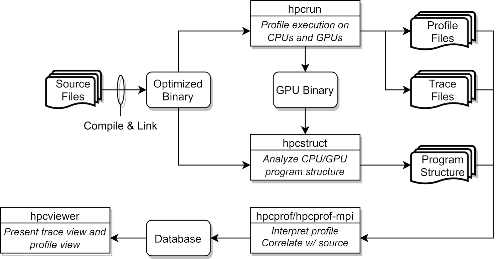

<!--
SPDX-FileCopyrightText: Contributors to the HPCToolkit Project

SPDX-License-Identifier: CC-BY-4.0
-->

# HPCToolkit Overview

```{figure-md} fig:hpctoolkit-overview:a


Figure 2.1: Overview of HPCToolkit's tool work flow.
```

HPCToolkit's work flow is organized around four principal capabilities, as shown in Figure [2.1](#fig:hpctoolkit-overview:a):

1. *measurement* of context-sensitive performance metrics using call-stack unwinding
   while an application executes;

1. *binary analysis* to recover program structure from the application binary and the shared libraries
   and GPU binaries used in the run;

1. *attribution* of performance metrics by correlating dynamic performance metrics with static program structure; and

1. *presentation* of performance metrics and associated source code.

To use HPCToolkit to measure and analyze an application's performance, one first compiles and links the application for a production run, using *full* optimization and including debugging symbols.
[^1]
Second, one launches an application with HPCToolkit's measurement tool, `hpcrun`, which uses asynchronous sampling to profile and trace CPU activity and vendor-provided libraries to profile and trace GPU activity.
Third, one invokes `hpcstruct`, HPCToolkit's tool for analyzing an application binary and any shared objects and GPU binaries used in a measured execution. `hpcstruct` recovers
information about source files, procedures, loops, and inlined code that are found in CPU and GPU binaries.
Fourth, one uses `hpcprof` to combine information about an application's structure with dynamic performance measurements to produce a performance database.
Finally, one explores a performance database with HPCToolkit's `hpcviewer` graphical user interface.

The rest of this chapter briefly discusses unique aspects of HPCToolkit's measurement, analysis and presentation capabilities.

## Call Path Profiling

Without accurate measurement, performance analysis results may be of questionable value.
As a result, a principal focus of work on HPCToolkit has been the design and implementation of techniques to provide accurate fine-grain measurements of production applications running at scale.
For tools to be useful on production applications on large-scale parallel systems, large measurement overhead is unacceptable.
For measurements to be accurate, performance tools must avoid introducing measurement error.

Both source-level and binary instrumentation can distort application performance through a variety of mechanisms ([Mytkowicz et al. 2009](https://doi.org/10.1145/2528521.1508275)).
Frequent calls to small instrumented procedures can lead to considerable measurement overhead.
Furthermore, source-level instrumentation can distort application performance by interfering with inlining and template optimization.
To avoid these effects, many instrumentation-based tools intentionally refrain from instrumenting certain procedures.
Ironically, the more this approach reduces overhead, the more it introduces *blind spots*, i.e., intervals of unmonitored execution.
For example, a common selective instrumentation technique is to ignore small frequently executed procedures; however, those routines may be mutex lock operations that introduce performance bottlenecks!
Sometimes, a tool unintentionally introduces a blind spot.
A typical example is that source code instrumentation suffers from blind spots when source code is unavailable, a common condition for vendor-provided math and communication libraries.

To avoid these problems, HPCToolkit eschews instrumentation and favors the use of *asynchronous sampling* to measure and attribute performance metrics.
During a program execution, sample events are triggered by periodic interrupts induced by an interval timer or overflow of hardware performance counters.
One can sample metrics that reflect work (e.g., instructions, floating-point operations), consumption of resources (e.g., cycles, bandwidth consumed in the memory hierarchy by data transfers in response to cache misses), or inefficiency (e.g., stall cycles).
For reasonable sampling frequencies, the overhead and distortion introduced by sampling-based measurement is typically much lower than that introduced by instrumentation ([Froyd, Mellor-Crummey, and Fowler 2005](https://doi.acm.org/10.1145/1088149.1088161)).

For all but the most trivially structured programs, it is important to associate the costs incurred by each procedure with the contexts in which the procedure is called.
Knowing the context in which each cost is incurred is essential for understanding why the code performs as it does.
This is particularly important for code based on application frameworks and libraries.
For instance, costs incurred for calls to communication primitives (e.g., `MPI_Wait`) or code that results from instantiating C++ templates for data structures can vary widely depending how they are used in a particular context.
Because there are often layered implementations within applications and libraries, it is insufficient either to insert instrumentation at any one level or to distinguish costs based only upon the immediate caller.
For this reason, HPCToolkit uses call path profiling to attribute costs to the full calling contexts in which they are incurred.

HPCToolkit's `hpcrun` call path profiler uses call stack unwinding to attribute execution costs of optimized executables to the full calling context in which they occur.
Unlike other tools, to support asynchronous call stack unwinding during execution of optimized code, `hpcrun` uses on-the-fly binary analysis to locate procedure bounds and compute an unwind recipe for each code range within each procedure ([Tallent, Mellor-Crummey, and Fagan 2009](https://doi.acm.org/10.1145/1542476.1542526)).
These analyses enable `hpcrun` to unwind call stacks for optimized code with little or no information other than an application's machine code.

The output of a run with `hpcrun` is a *measurements directory* containing the data, and the information necessary
to recover the names of all shared libraries and GPU binaries.

## Recovering Program Structure

To enable effective analysis, call path profiles for executions of optimized programs must be correlated
with important source code abstractions.
Since measurements refer only to instruction addresses within the running application,
it is necessary to map measurements back to the program source.
The mappings include those of the application and any shared libraries referenced during the
run, as well as those for any GPU binaries executed on GPUs during the run.
To associate measurement data with the static structure of fully-optimized executables,
we need a mapping between object code and its associated source code structure.[^2]
HPCToolkit constructs this mapping using binary analysis; we call this process
*recovering program structure* ([Tallent, Mellor-Crummey, and Fagan 2009](https://doi.acm.org/10.1145/1542476.1542526)).

HPCToolkit focuses its efforts on recovering source files, procedures, inlined functions and templates, as well as
loop nests as the most important elements of source code structure.
To recover program structure, HPCToolkit's `hpcstruct` utility parses a binary's machine instructions,
reconstructs a control flow graph, combines line map and DWARF information about inlining with interval
analysis on the control flow graph in a way that enables it to relate machine code after optimization
back to the original source.

One important benefit accrues from this approach.
HPCToolkit can expose the structure of and assign metrics to the code is actually executed, *even if source code is unavailable*.
For example, `hpcstruct`'s program structure naturally reveals transformations such as loop fusion and scalarization
loops that arise from compilation of Fortran 90 array notation.
Similarly, it exposes calls to compiler support routines and wait loops in communication libraries of which one would otherwise be unaware.

## Attributing Performance to Code

HPCToolkit combines (post-mortem) the recovered static program structure with dynamic call paths to expose inlined frames and loop nests.
This enables us to attribute the performance of samples in their full static and dynamic context and correlate it with source code.

HPCToolkit's `hpcprof` utility employs multithreading to quickly aggregate performance measurements from multiple threads and processes and attribute them to application and/or library CPU and GPU source code.

One uses `hpcprof` by invoking it on the *measurements directory* recorded by `hpcrun` and augmented with program structure information by `hpcstruct`.
From the measurements and structure, `hpcprof` generates a *database directory* containing performance data presentable by `hpcviewer`.

In most cases `hpcprof` is able to complete the reduction in minutes, however for especially large experiments (e.g. thousands of threads or GPU streams ([Anderson, Liu, and Mellor-Crummey 2022](https://doi.org/10.1145/3524059.3532397))) its multi-node sibling `hpcprof-mpi` may be substantially faster.
`hpcprof-mpi` is an MPI application identical to `hpcprof`, except that employs distributed-memory parallelism in addition to multithreading to aggregate and attribute performance measurements for many CPUs and GPUs.
In our experience, exploiting 8-10 compute nodes via `hpcprof-mpi` can be as much as 5x faster than `hpcprof` for analyzing performance measurements from thousands of CPUs and GPUs.

## Interactive Performance Analysis

To enable an analyst to rapidly pinpoint and quantify performance bottlenecks, tools must present the performance measurements in a way that engages the analyst, focuses attention on what is important, and automates common analysis subtasks to reduce the mental effort and frustration of sifting through a sea of measurement details.

To enable rapid analysis of an execution's performance bottlenecks, we have carefully designed HPCToolkit's `hpcviewer` graphical user interface. `hpcviewer` provide code-centric profile views ([Adhianto, Mellor-Crummey, and Tallent 2010](https://dx.doi.org/10.1109/ICPPW.2010.35)), thread-centric graphing of metrics, and time-centric views of CPU and GPU activity ([Tallent et al. 2011](https://doi.acm.org/10.1145/1995896.1995908)).

`hpcviewer` combines a relatively small set of complementary presentation techniques that, taken together, rapidly focus an analyst's attention on performance bottlenecks rather than on unimportant information.
To facilitate the goal of rapidly focusing an analyst's attention on performance bottlenecks `hpcviewer`
extends several existing presentation techniques.
In its code-centric view, `hpcviewer` (1) synthesizes and presents top-down, bottom-up, and flat views of calling-context-sensitive metrics;
(2) treats a procedure's static structure as first-class information with respect to both performance metrics
and constructing views; (3) enables a large variety of user-defined metrics to describe performance inefficiency;
and (4) automatically expands hot paths based on arbitrary performance metrics --- through calling contexts and static structure --- to rapidly highlight important performance data.

`hpcviewer`'s time-centric trace tab enables an application developer to visualize how a parallel execution unfolds over time.
This view makes it easy to spot key inefficiencies such as serialization and load imbalance.

[^1]: For the most detailed attribution of application performance data using HPCToolkit, one should ensure that the compiler includes line mappings in the object code it generates. While HPCToolkit does not need this information to function, it can be helpful to users trying to interpret the results. Since compilers can usually provide line map information for fully optimized code, this requirement need not require a special build process. While adding a `-g` flag is the right thing to do for many compilers, some compilers provide other flags that provide line mapping and inlining information for profiling without compromising optimization. For instance, when compiling CUDA for NVIDIA GPUs with nvcc, one should use `-lineinfo` rather than `-g` to avoid inadvertently disabling optimization.

[^2]: This object to source code mapping should be contrasted with a binary's line map, which
    (if present) only maps machine instructions to source lines.
